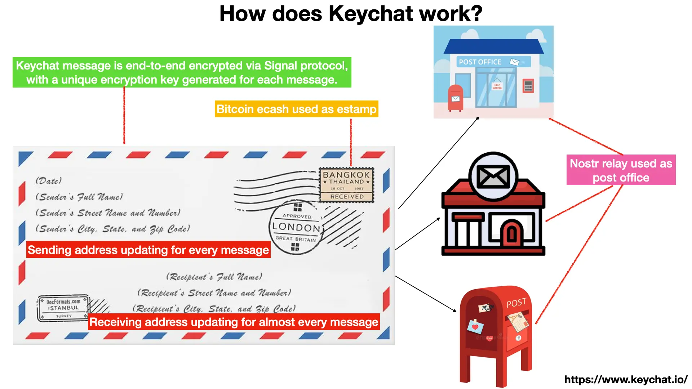
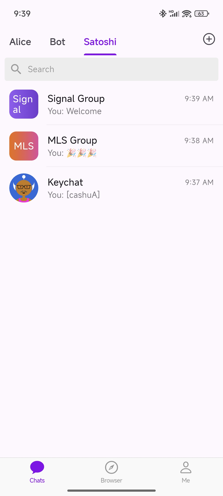
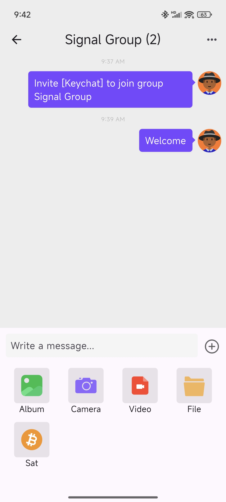
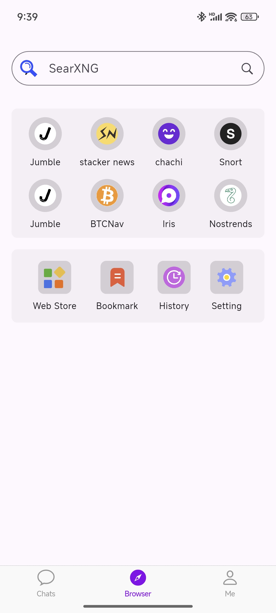
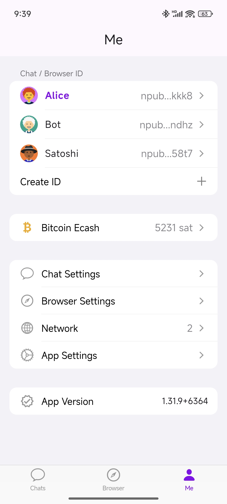
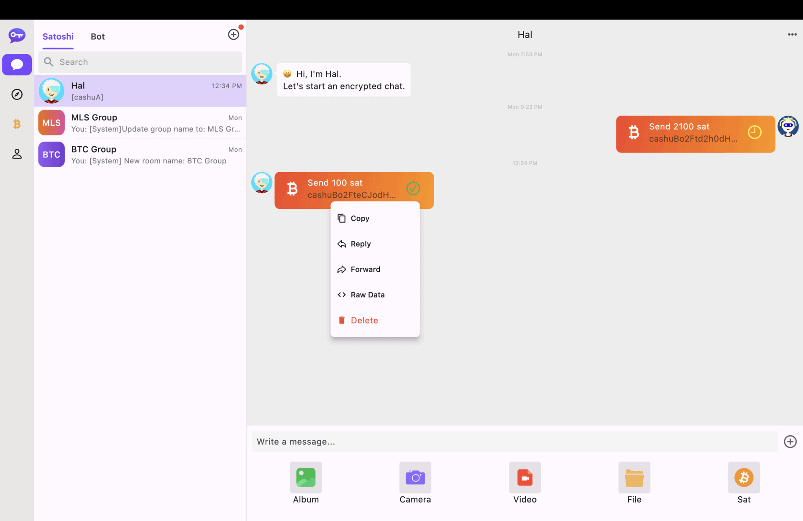

# Keychat

[](https://github.com/keychat-io/keychat-apph/releases/)[](https://github.com/keychat-io/keychat-app/releases/)[](LICENSE)
[](https://github.com/keychat-io/keychat-app/actions/workflows/build.yaml)


## About Keychat

Keychat is a chat app, built on [Bitcoin Ecash](https://cashu.space/), [Nostr Protocol](https://github.com/nostr-protocol/nips), [Signal Protocol](https://github.com/signalapp/libsignal) and [MLS Protocol](https://messaginglayersecurity.rocks/).

Keychat is inspired by the postal system — stamps, post offices, letters.

Keychat uses Bitcoin ecash as stamps and Nostr relays as post offices.

Senders send messages stamped with Bitcoin ecash to Nostr relays. The Nostr relays collect the Bitcoin ecash, then deliver messages to receivers.

Keychat uses Signal/MLS protocol to ensure message encryption security and meta-data privacy.

The content of the letter can be exposed easily by opening the envelope. Keychat messages are end-to-end encrypted via Signal/MLS protocol, with a unique encryption key generated for each message. Only the sender and receiver can decrypt the message.

The addresses of both parties on the envelope can be tracked. In theory, this problem is solved if they change addresses daily. So Keychat reuses Signal/MLS protocol to update sending and receiving addresses for nearly every message.

Like the postal system, Keychat requires no registration. Users just generate Nostr keys as ID.

<p>

</p>

### Design Philosoph
Offline Me needs self-controlled IDs and wallets to live in the physical world.

Online Me also first needs self-controlled IDs and wallets to live in the digital world.

Then Me can chat and browse.

In Chat, Me uses the IDs and pays for relays per message with the wallets.

In Browser, Me uses the IDs to log in to Mini Apps and pays in Bitcoin with the wallets.


### Mobile Screenshot
<p>




</p>

### Desktop Screenshot
<p>

</p>

## Download

- [Android APK](https://github.com/keychat-io/keychat-app/releases)
- [MacOS-arm64](https://github.com/keychat-io/keychat-app/releases)
- [iOS](https://apps.apple.com/us/app/keychat-io/id6447493752)
- GooglePlay: Coming
- [Windows-x86_64](https://github.com/keychat-io/keychat-app/releases)
- [Linux](https://github.com/keychat-io/keychat-app/releases)

## Install Requirements
- Android: >= 12
- iOS: >= 15
- MacOS: >= 13
- Windows: Lack of signature and notary for now, turn off anti-virus software before installation
- Linux: `sudo dpkg -i ./xx.deb`

## Follow Us
[npub1h0uj825jgcr9lzxyp37ehasuenq070707pj63je07n8mkcsg3u0qnsrwx8](https://jumble.social/users/npub1h0uj825jgcr9lzxyp37ehasuenq070707pj63je07n8mkcsg3u0qnsrwx8)

## Spec Compliance

Keychat implements the following nips:

- [NIP-01: Basic protocol flow][nip01]
- [NIP-06: Basic key derivation from mnemonic seed phrase][nip06]
- [NIP-07: window.nostr capability for web browsers][nip07]
- [NIP-17: Private Direct Messages][nip17]
- [NIP-19: Bech32-encoded entities][NIP19]
- [NIP-44: Encrypted Payloads][NIP44]
- [NIP-47: Nostr Wallet Connect][NIP47]
- [NIP-55: Android Signer Application][nip55]
- [NIP-59: Gift Wrap][NIP19]
- [NIP-B7: Blossom Media](B7)
 
[nips]: https://github.com/nostr-protocol/nips
[nip01]: https://github.com/nostr-protocol/nips/blob/master/01.md
[nip17]: https://github.com/nostr-protocol/nips/blob/master/17.md
[nip06]: https://github.com/nostr-protocol/nips/blob/master/06.md
[nip07]: https://github.com/nostr-protocol/nips/blob/master/07.md
[nip19]: https://github.com/nostr-protocol/nips/blob/master/19.md
[nip44]: https://github.com/nostr-protocol/nips/blob/master/44.md
[nip47]: https://github.com/nostr-protocol/nips/blob/master/47.md
[nip55]: https://github.com/nostr-protocol/nips/blob/master/55.md
[B7]: https://github.com/nostr-protocol/nips/blob/master/B7.md

## WebLN Provider
[webln.dev](https://www.webln.dev/)

[x] sendPayment
[x] makeInvoice

## Universal Link
### Add a contact from pubkey
`https://www.keychat.io/u/xxx`

Demo: [https://www.keychat.io/u/npub1h0uj825jgcr9lzxyp37ehasuenq070707pj63je07n8mkcsg3u0qnsrwx8](https://www.keychat.io/u/npub1h0uj825jgcr9lzxyp37ehasuenq070707pj63je07n8mkcsg3u0qnsrwx8)

## Deeplink
Add a contact
```
keychat://www.keychat.io/u/npub1h0uj825jgcr9lzxyp37ehasuenq070707pj63je07n8mkcsg3u0qnsrwx8
```

### Supported Intent / Scheme

```
adb shell am start -W -a android.intent.action.VIEW -d "scheme:xxxx"
```

- nostr. Add a contact, eg: `nostr:npub1h0uj825jgcr9lzxyp37ehasuenq070707pj63je07n8mkcsg3u0qnsrwx8`
- cashu. Receive cashu token, eg: `cashu:cashuBo2FteBxxx`
- lightning. Pay Lightning Invoice, eg: `lightning:npub1h0uj825jgcr9lzxyp37ehasuenq070707pj63je07n8mkcsg3u0qnsrwx8`
- lnurlp. Pay to Lightning address, eg: `lightning:LNURL1DP68GURN8GHJ7UM9WFMXJCM99E3K7MF0V9CXJ0M385EKVCENXC6R2C35XVUKXEFCV5MKVV34X5EKZD3EV56NYD3HXQURZEPEXEJXXEPNXSCRVWFNV9NXZCN9XQ6XYEFHVGCXXCMYXYMNSERXFQ5FNS`


## Development Getting Started

```
git submodule update --init --recursive
dart pub global activate melos 7.0.0-dev.9
melos bootstrap

# build rust lib: packages\keychat_rust_ffi_plugin\README.md
# cd packages/keychat_rust_ffi_plugin
# git submodule update --init --recursive

cd packages/app
flutter devices
flutter run -d xxx

# release
melos run build:ios 
melos run build:android
melos run build:macos

# windows
dart pub global activate fastforge
```

## Based On

- [Nostr Protocol](https://nostr.com/): for delivering and storing messages.
- [Ecash Cashu](https://cashu.space/): for paying micropayments to relays (optional), depends on whether relay charges a fee.
- [Signal Protocol](https://github.com/signalapp/libsignal): for encrypting messages (end-to-end).
- [MLS Protocol](https://github.com/signalapp/libsignal): messaging Layer Security (MLS) is a security layer for encrypting messages in large group. 
- AWS S3: for storing encrypted files.
- [Isar DB](https://github.com/isar/isar): a NoSQL database for Flutter for local data storage.
- [flutter_rust_bridge](https://github.com/fzyzcjy/flutter_rust_bridge/): Flutter/Dart <-> Rust binding generator, feature-rich, but seamless and simple.
- [melos](https://melos.invertase.dev/): Melos is a CLI tool used to help manage Dart projects with multiple packages
- [rust-nostr](https://github.com/rust-nostr/nostr): Nostr protocol implementation, SDK and FFI

## License

Licensed under the GNU AGPLv3: [https://www.gnu.org/licenses/agpl-3.0.html](https://www.gnu.org/licenses/agpl-3.0.html)
